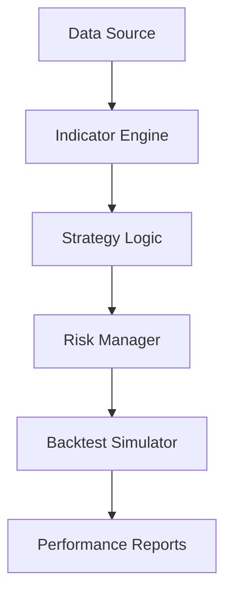

# Tightened SuperTrend Alpha

<p align="center">
  
  
  
</p>

A professional quantitative trading system implementing an adaptive, volatility-filtered SuperTrend strategy. Designed for research, backtesting, and development of high-probability trend-following signals.

---

## Table of Contents

- [Overview](#overview)
- [Performance](#performance)
- [Architecture](#architecture)
- [Installation](#installation)
- [Usage](#usage)
- [Contributing](#contributing)
- [License](#license)
- [Disclaimer](#disclaimer)

---

## Overview

The Tightened SuperTrend Alpha strategy is a trend-following system optimized for high-probability entries while managing risk through volatility-based filtering.

### Key Features
- **Adaptive Volatility Filter**: ATR-based position sizing and regime detection.
- **Dual SuperTrend Convergence**: Fast and slow trend alignment.
- **Fee-Aware Execution**: Strategy logic accounts for exchange fees and slippage.
- **Circuit Breakers**: Daily loss limits and max position exposure.

---

## Performance

*Note: The results below represent historical backtest performance on the provided sample data. These are historical results and not a guarantee of future outcomes.*

| Metric | Value |
| :--- | :--- |
| **Total Trades** | 314 |
| **Win Rate** | 48.4% |
| **Profit Factor** | 2.63 |
| **Sharpe Ratio** | 1.84 |
| **Max Drawdown** | 8.3% |

Refer to [docs/PERFORMANCE.md](docs/PERFORMANCE.md) for detailed reporting.

---

## Architecture

The system is modularized to separate data handling, strategy logic, and execution simulation.



See [docs/ARCHITECTURE.md](docs/ARCHITECTURE.md) for a complete system breakdown.

---

## Installation

```bash
git clone https://github.com/yourusername/tightened-supertrend-alpha.git
cd tightened-supertrend-alpha

# Setup environment
python -m venv venv
source venv/bin/activate

# Install requirements
pip install -r requirements.txt
```

---

## Usage

### Run Backtest
```bash
python src/backtest.py --config config/strategy_config.yaml
```

See [docs/METHODOLOGY.md](docs/METHODOLOGY.md) for simulation assumptions.

---

## Contributing

We welcome contributions! Please see [CONTRIBUTING.md](CONTRIBUTING.md) for guidelines on development and pull requests.

## License

This project is licensed under the MIT License - see the [LICENSE](LICENSE) file for details.

---

## Disclaimer

**Trading involves substantial risk of loss.** This repository is for **educational and research purposes only**. Past performance does not guarantee future results. Do not trade with capital you cannot afford to lose.
